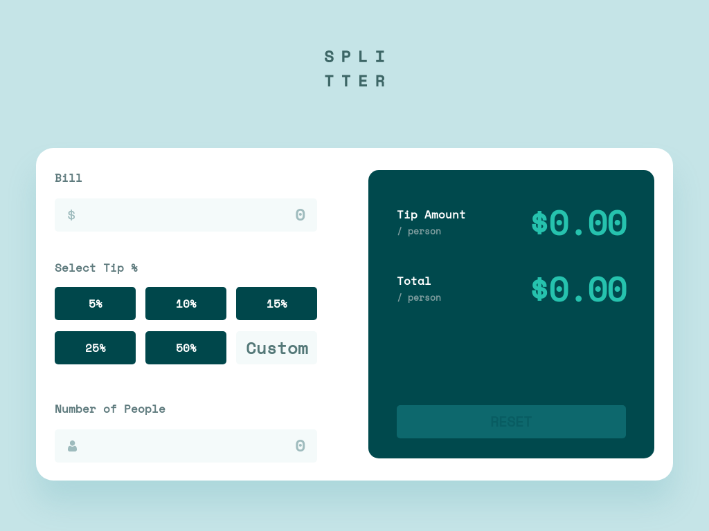

#  Tip Calculator

## Table of contents

- [Overview](#overview)
  - [The challenge](#the-challenge)
  - [Screenshot](#screenshot)
  - [Links](#links)
- [My process](#my-process)
  - [Built with](#built-with)
- [Author](#author)
- [Acknowledgments](#acknowledgments)

## Overview

### The challenge

Users should be able to:

- View the optimal layout for the app depending on their device's screen size
- See hover states for all interactive elements on the page
- Select and submit a number rating
- See the "Thank you" card state after submitting a rating

### Screenshot

### Links

- Solution URL: [Link](https://github.com/LukaKoridze13/interactive-rating)
- Live Site URL: [Link](https://interactiverating-lk.netlify.app/)

## My process

### Built with

- Semantic HTML5 markup
- CSS custom properties
- Flexbox
- Responsive
- [React](https://reactjs.org/) - JS library

## Author

- Linkedin - [Luka Koridze](https://www.linkedin.com/in/lukakoridze/)
- Frontend Mentor - [@LukaKoride13](https://www.frontendmentor.io/profile/LukaKoridze13)

